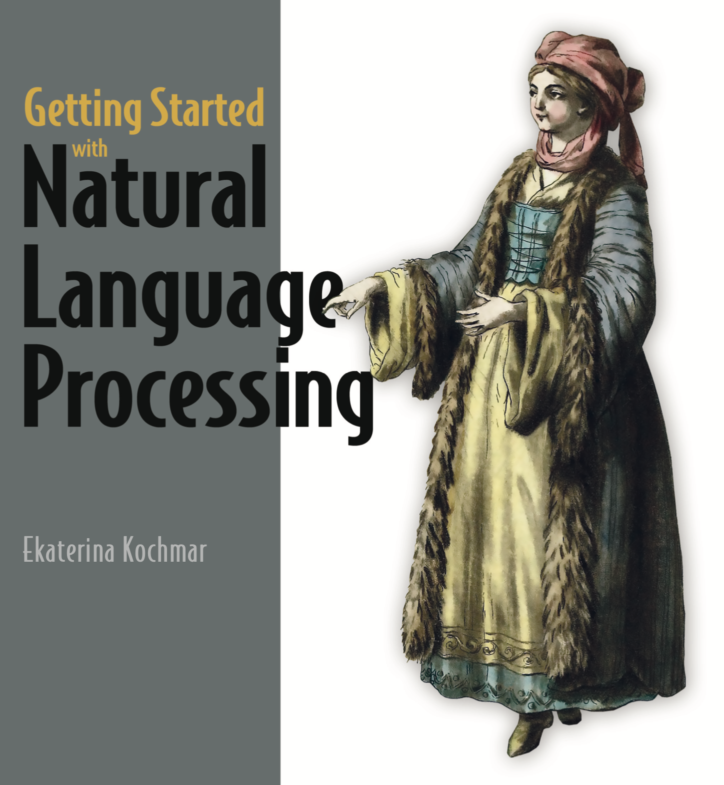

# `TDT 4310 - Intelligent Text Analytics and Language Understanding - Spring 2024`

Throughout this course, we will explore many core aspects of natural language processing, starting with the very latest developments within language models - specifically *large* language models. From there on, we move on to more traditional topics such as part-of-speech tagging, grammars, dependency parsing and tasks like sentiment analysis and topic modeling.

The four labs (and the first exercise) will hopefully prepare and motivate you for the course project, accounting for 75% of the final grade. Information around the project will reside on Blackboard.

## `📆 Labs and schedule`

All labs will be provided as Jupyter Notebooks (.ipynb). The first lab (lab 0) will be a simple question-answer setup, to get familiar with the format, only involving markdown cells. Labs 1 through 4 will require you to properly use the environment with a mix of markdown and code cells.

### Setup

Each lab will have files starting with the prefix `lab{N}`, ${N} \in \{0, 1, 2, 3, 4\}$. Each lab will have at least two files:

- `lab{N}_description.md` - a description of the lab
- `lab{N}_exercises.ipynb` - the main notebook with the exercises
  - **you will submit this file to blackboard**

### Delivery

By the deadline for each lab, you will submit your `lab{N}_exercises_{your-username}.ipynb` file to Blackboard. You can submit as many times as you want - only the last submission will be considered for pass/fail.

### Schedule

| Lab | Link | Published | Deadline | Topic | Libraries | Chapters |
| - | - | - | - | - | - | - |
| 1 | [Intro](labs/intro.ipynb) | Jan. 8 | Jan. 23 | Large language models | - | - |
| 2 | [Lab1](labs/lab1.ipynb) | Jan. 23 | Feb. 6 | Tokenization, introduction to word vectors and language modeling | NLTK | 2, 3 |
| 3 | [Lab2](labs/lab2.ipynb)| Feb. 6 | Feb. 20 | Part-of-speech tagging, stemming/lemmatization, TF-IDF | NLTK, spaCy | 4, 5, 6 |
| 4 | [Lab3](labs/lab3.ipynb)| Feb. 20 | Mar. 5 | Wordnet and SentiWordNet, dependency parsing, POS chunking | spaCy, Scikit-learn | 7, 8 |
| 5 | [Lab4](labs/lab4.ipynb)| Mar. 5 | Mar. 19 | Unsupervised topic modeling and named entities | Gensim | 9, 10, 11 |

## `📚 Curriculum`

The course curriculum is mostly based around the 2022 book by *Ekaterina Kochmar* - Getting Started with Natural Language Processing. It is available on [Akademika](https://www.akademika.no/teknologi/data-og-informasjonsteknologi/getting-started-natural-language-processing/9781617296765).

    

